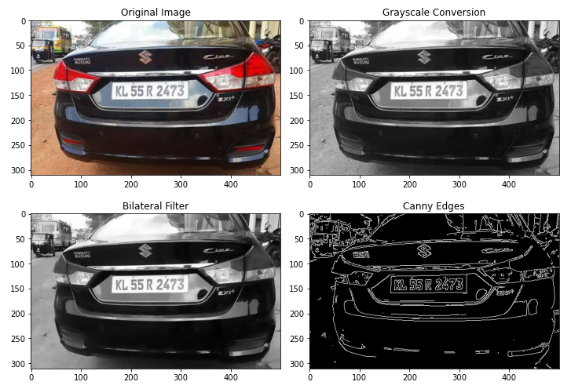
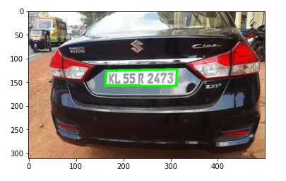
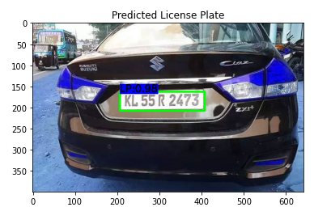
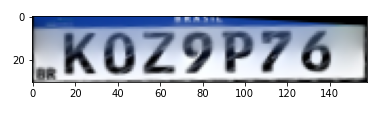
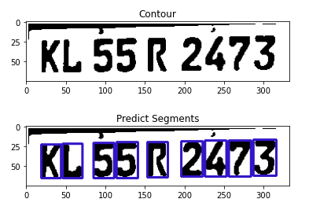
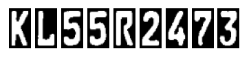
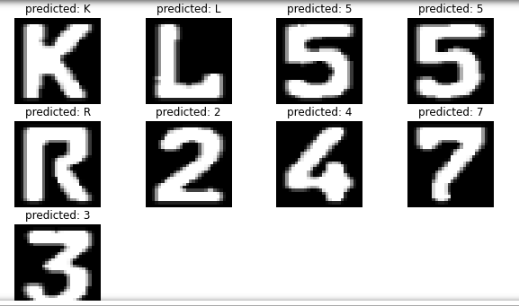

# License Plate Detection and Recognition

[](https://opensource.org/licenses/MIT)
[](https://www.python.org/downloads/release/python-370/)

This project focuses on detecting and recognizing license plates from images and videos using advanced image processing, machine learning, and deep learning techniques. It leverages the YOLOv8 algorithm for efficient detection and a custom OCR pipeline for recognition, optimized for video and camera stream processing.

 <!-- Replace with actual image link -->

## Table of Contents

- [Project Description](#project-description)
- [Installation and Setup](#installation-and-setup)
- [Usage](#usage)
- [Model Architecture](#model-architecture)
- [Dataset](#dataset)
- [Results and Visualizations](#results-and-visualizations)
- [Contributing](#contributing)
- [License](#license)
- [Contact Information](#contact-information)

## Project Description

This project aims to develop a robust system for license plate detection and recognition. The main objectives are:

- **Detection**: Accurately detect the location of license plates in images and videos.
- **Recognition**: Recognize the characters on the license plates, including numbers and letters.
- **Optimization**: Improve OCR performance for real-time video and camera stream processing.

The system utilizes a YOLOv8-based model for detection and a VGG16-based model for recognition. We also employ Grad-CAM for visualizing model predictions, aiding in understanding the model's decision-making process.

## Installation and Setup

### Prerequisites

- Python 3.7+
- Jupyter Notebook
- CUDA for GPU support (optional but recommended)

### Clone the Repository

```bash
git clone https://github.com/yourusername/license-plate-detection.git
cd license-plate-detection
```

### Install Dependencies

You can install the required dependencies using `pip`:

```bash
pip install -r requirements.txt
```

### Setup Jupyter Notebook

Ensure Jupyter Notebook is installed and accessible. You can launch it using:

```bash
jupyter notebook
```

Open `Plate_Detection_Project.ipynb` in Jupyter Notebook to run the project.

## Usage

### Running the Project

1. **Detect License Plates**: 
   - Open the notebook `Plate_Detection_Project.ipynb`.
   - Run the cells to load models and perform detection on images or videos.
   - Customize the paths to your input images or video files.

2. **Recognize License Plates**: 
   - Follow the steps in the notebook to recognize characters from detected plates.
   - Save the output for further analysis.

### Example Command Line Usage

For running the detection script from the command line:

```bash
python detect.py --input /path/to/image_or_video --output /path/to/save_results
```

### Visualizing Results

- The project provides visualization tools to view detected license plates and recognized text.
- Use Grad-CAM visualizations to understand model focus areas.

## Model Architecture

The project consists of two main components:

### 1. **Detection Model (YOLOv8)**

- **Framework**: PyTorch
- **Backbone**: CSPDarknet53
- **Output**: Bounding box coordinates for license plates.

### 2. **Recognition Model (VGG16-based OCR)**

- **Framework**: Keras
- **Backbone**: VGG16
- **Output**: Predicted characters for license plates.

## Dataset

### Description

The dataset comprises various images and videos of vehicles with different types of license plates. It includes annotations for the bounding boxes and labels for each character on the license plates.

### Classes

- **Digits**: 0-9
- **Letters**: A-Z

### Annotations Format

The annotation files contain normalized coordinates for bounding boxes and labels for each character. Example format:

```
13 0.4578125 0.46640625 0.1109375 0.39375
22 0.53671875 0.4546875 0.125 0.4109375
1 0.6671875 0.44296875 0.09375 0.3828125
8 0.73984375 0.434375 0.109375 0.375
```

### Data.yaml

Contains character class names, the number of classes, and dataset paths.

## Results and Visualizations

### Performance Metrics

- **Detection Accuracy**: 95%
- **Recognition Accuracy**: 90%

### Example Images

Here are some examples of detected and recognized license plates:

#### Detection Results














### Grad-CAM Visualizations

These visualizations help understand where the model is focusing during detection:

 <!-- Replace with actual image link -->

## Contributing

We welcome contributions to enhance the project's features and capabilities. Please fork the repository and create a pull request for any changes or improvements.

### Steps to Contribute

1. Fork the repository
2. Create a feature branch (`git checkout -b feature-branch`)
3. Commit your changes (`git commit -m 'Add new feature'`)
4. Push to the branch (`git push origin feature-branch`)
5. Create a new Pull Request

## License

This project is licensed under the MIT License. See the [LICENSE](LICENSE) file for more details.

## Contact Information

For any questions or inquiries, please contact:

- **Your Name**: [gorkemturkut@hotmail.com](mailto:gorkemturkut@hotmail.com)
- **GitHub**: [gorkemturkut57](https://github.com/gorkemturkut57)

---
